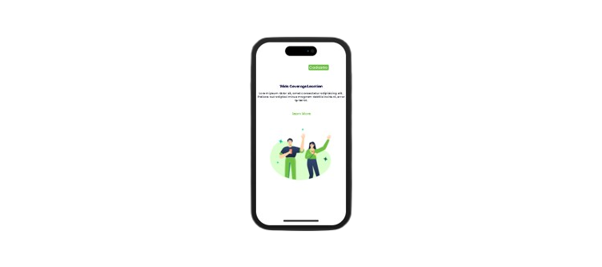
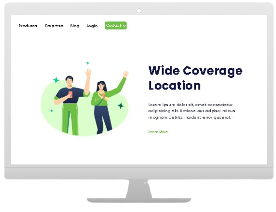

# 📍 Wide Coverage Location

> Landing page responsiva desenvolvida com HTML e CSS puro, baseada em design do Figma.

---

## 📋 Sobre o Projeto

O **Wide Coverage Location** é uma landing page mobile-first que apresenta uma solução de transporte compartilhado. O projeto foi desenvolvido como prática de HTML e CSS, com foco em responsividade e fidelidade ao design original criado no Figma.

---

## 🎨 Layout

<div align="center">

|                📱 Mobile — iPhone 17                 |                 🖥️ Desktop — iMac                  |
| :--------------------------------------------------: | :------------------------------------------------: |
|  |  |

</div>

---

## 🚀 Tecnologias Utilizadas

-  **HTML5** — Estrutura da página
-  **CSS3** — Estilização e responsividade
- **Flexbox** — Alinhamento e layout
- **Media Queries** — Responsividade mobile
- **Google Fonts (Poppins)** — Tipografia

---

## 📁 Estrutura de Arquivos

```
📦 wide-coverage-location/
├── 📄 index.html          → Página principal
├── 🎨 styles.css          → Estilos da página
├── 🖥️  mockup.html         → Mockup iMac (desktop)
├── 📱 mockup-iphone.html  → Mockup iPhone 17 (mobile)
└── 📁 assets/
    └── 🖼️  imagem.png      → Ilustração dos personagens
```

---

## 🌐 Acesse o Projeto

👉 [Clique aqui para acessar](https://seu-usuario.github.io/wide-coverage-location)

> Troque o link pelo seu endereço do GitHub Pages.

---

## 📐 Funcionalidades

- ✅ Layout responsivo (mobile e desktop)
- ✅ Botão de Cadastro no header
- ✅ Título e parágrafo centralizados
- ✅ Imagem ilustrativa dos personagens
- ✅ Link "Learn More"
- ✅ Mockup iMac interativo
- ✅ Mockup iPhone 17 com Dynamic Island

---

## 👨‍💻 Autor Lincoln A. Neres

Feito com 💚 durante os estudos de desenvolvimento web.

---
